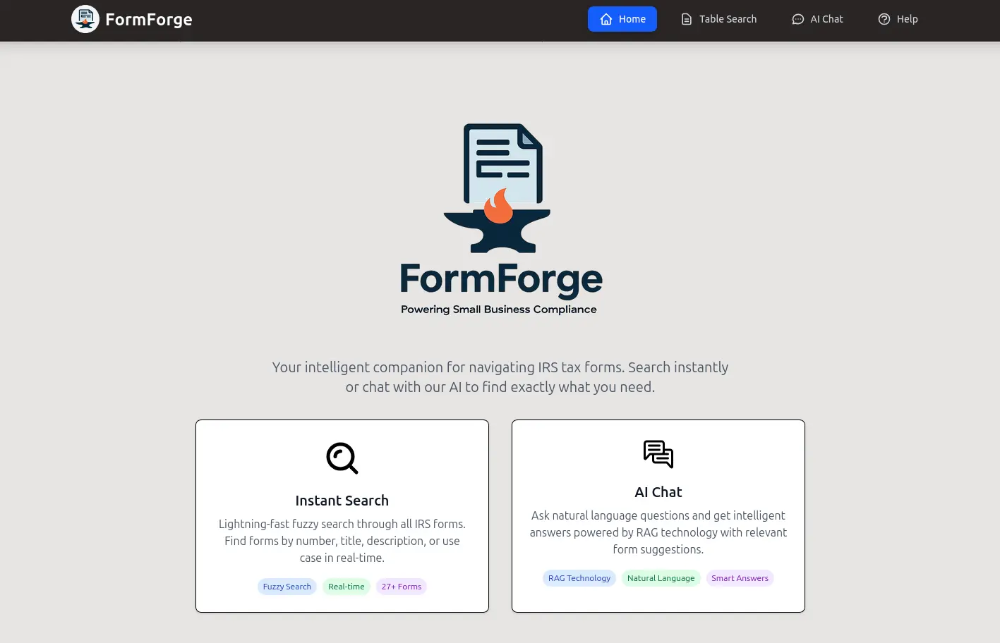
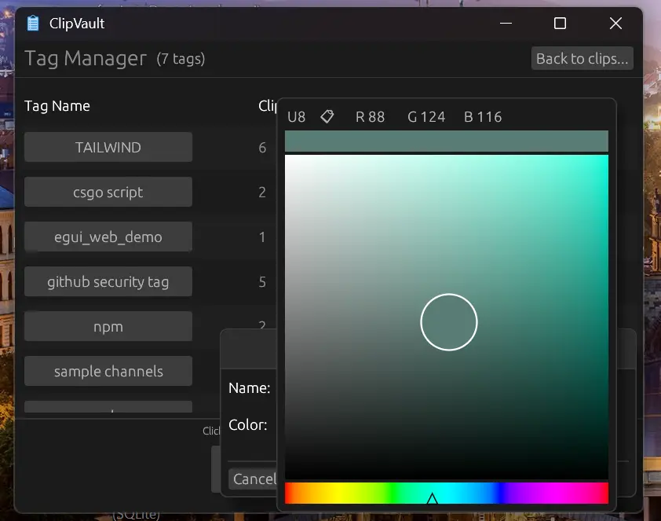
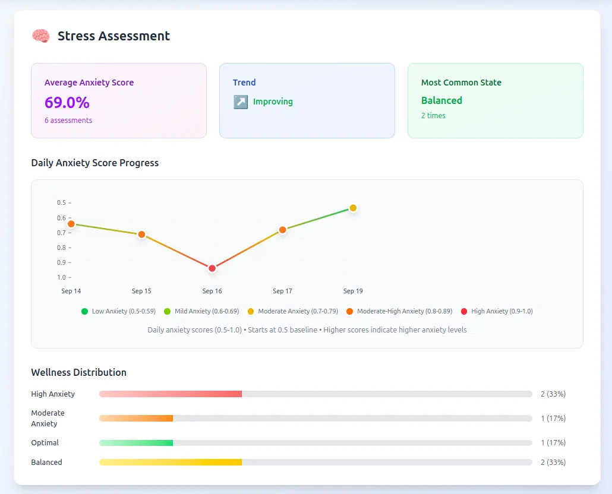
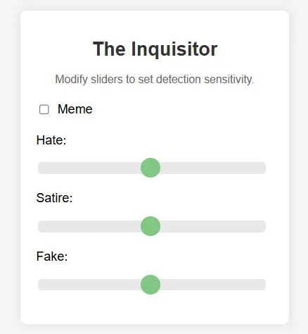

# Featured Projects

## FormForge

An AI-assisted web app that helps users find and file **IRS tax forms**. Built in two weeks for a hackathon on AI for small businesses, it uses a FastAPI backend to serve recommendations from a HuggingFace sentence-transformer.

**Award:** Second Place - AI in Action Hackathon 2025 (3 weeks)

### Technologies
- React
- FastAPI
- Sentence-Transformers

**Links:**
- [GitHub Repository](https://github.com/remysedlak/aiah-2025)

---

## ClipVault

A system tray clipboard manager written in Rust. Includes **custom tagging** and searching capabilities. Architected modular components and implemented inter-thread communication and event handling.

### Technologies
- Rust
- SQLite

**Links:**
- [GitHub Repository](https://github.com/remysedlak/clipvault)

---

## Rooted Reflections

An **AI anxiety predictor** trained on student mental health data. Built a web app using **TensorFlow.js** to run the model **in-browser**, ensuring **user privacy**. This project won **third place** in "**Predict the Unpredictable**" at SteelHacks 2025.

**Award:** Third Place - SteelHacks 2025 "Predict the Unpredictable" (24 hours)

### Technologies
- React
- TensorFlow.js
- Tailwind CSS

**Links:**
- [GitHub Repository](https://github.com/remysedlak/steelhacks-2025)
- [Devpost Submission](https://devpost.com/software/rooted-reflections)

---

## The Inquisitor

An **AI political deepfake detector** aimed at lessening political misinformation. Implemented as a **Chrome Extension** with a user-friendly interface for backend customizability. Earned an **Honorable Mention** and presented work at the governor's residence in Harrisburg, PA.

**Award:** Honorable Mention - Hacking4Humanity 2025 | Governor's Residence Presentation

### Technologies
- Chrome Extension
- TensorFlow

**Links:**
- [GitHub Repository](https://github.com/DSmith215/The-Inquistor)
