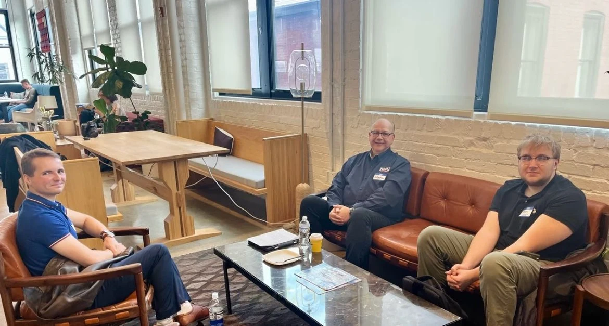
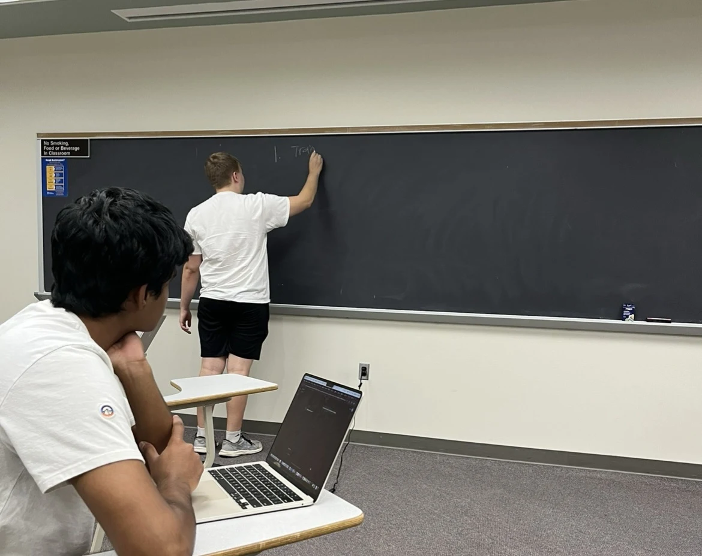
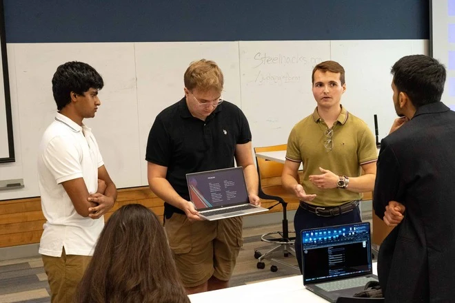
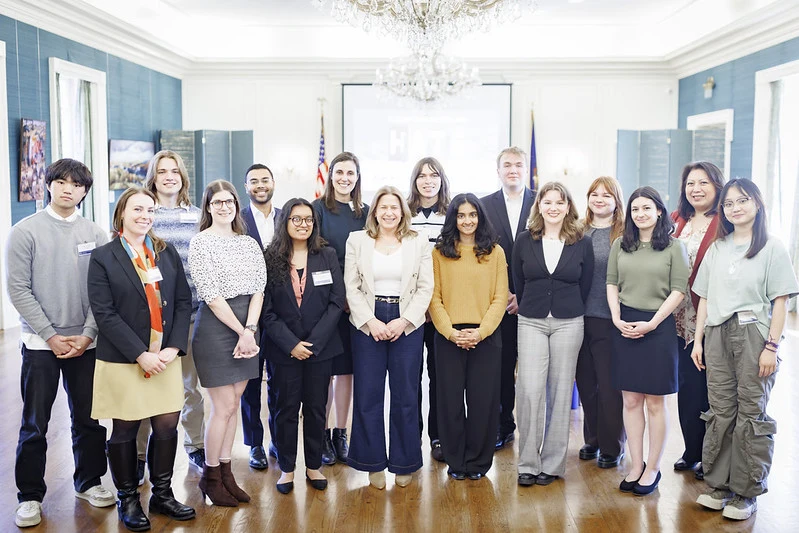
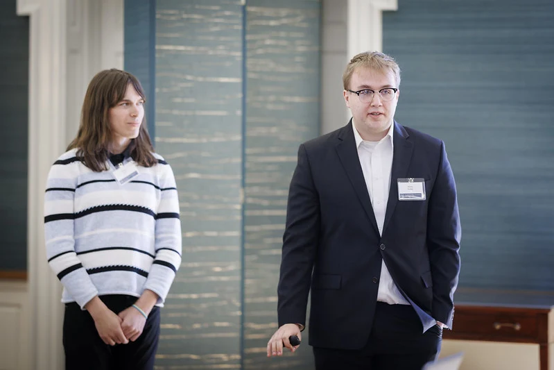
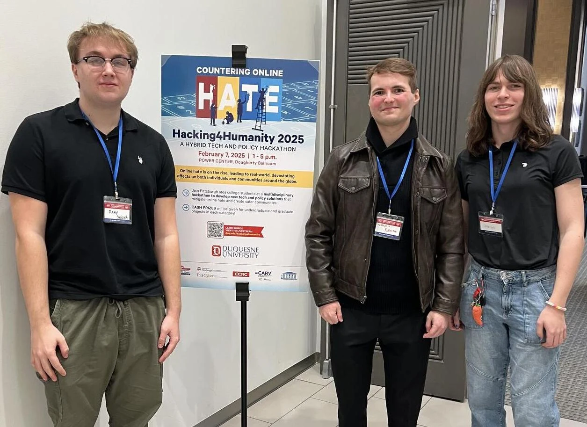

# Timeline

My journey through technology, learning, and building.

---

## 2025 • Second Place at AIAH

**Duration:** 3 weeks

Competed in the AI in Action Hackathon hosted by Robert Morris University, where I collaborated with friend Will, mentor Nigel, and sponsor CacheAI to develop a functional AI chatbot to help file and find small business tax forms. The model was trained on IRS form metadata, sample conversations, and utilized template responses to ensure the safety of clients and their information. This was one of my favorite projects I've gotten to work on.

---

## 2025 • Third Place at SteelHacks

**Duration:** 24 hours

Competed in SteelHacks XII, a hackathon hosted by the University of Pittsburgh, where I collaborated with data scientists to develop an ML anxiety predictor web app for students. Our project earned third place in the "Predict the Unpredictable" track. This event was incredibly fun, and I enjoyed seeing every team's amazing innovations.

---

## 2025 • Internship @ AGI

**Duration:** 12 weeks (Summer)

Returned to AssetGenie for a summer internship focused on backend development and data engineering. Contributed to enhancing internal operations by designing and implementing automated data processing solutions. Collaborated closely with engineers and directors to improve system performance, streamline workflows, and strengthen database management processes.

---

## 2025 • Hacking4Humanity Finals

**Duration:** 1 month

Continuing the hackathon project from February, Devon and I were honored to present our Deepfake Detector in Harrisburg to a panel of judges, including Pennsylvania's First Lady, Lori Shapiro. The governor's residence was breathtaking, and the event emphasized the growing importance of AI ethics in real-world applications.

---

## 2025 • Peer Tutoring

**Duration:** 5 months (During sophomore year)

Started providing one-on-one tutoring sessions for SCI courses at Pitt, guiding students through fundamental and advanced programming concepts. This opportunity allowed me to strengthen students' problem-solving and debugging skills, while I strengthened my own communication.

---

## 2025 • Hacking4Humanity

**Duration:** 2 weeks

Competed in Hacking4Humanity 2025, a hackathon focused on AI for social good, where I collaborated with a team to develop an AI-powered deepfake detection model. The project earned an Honorable Mention, and this experience deepened my passion for AI ethics, adversarial machine learning, and responsible AI development.

---

## 2024 • Internship @ AGI

**Duration:** 8 weeks

Secured my first technical internship at AssetGenie Inc., where I built Python automation tools integrated with GitLab and Excel to streamline data processing workflows. Gained hands-on experience in data engineering, scripting, and backend development, enhancing operational efficiency across teams. Worked in a fast-paced environment, collaborating with engineers to optimize automation processes and improve internal data management systems.

---

## 2023 • CS @ Pitt

**Duration:** 4 years (Ongoing)

Began my pursuit of a B.S. in Computer Science and Minor in Computer Engineering at the University of Pittsburgh, with a focus on the intersection of technology and human behavior. Applying interdisciplinary knowledge to real-world projects in AI, UX design, and music technology.

---

## 2022 • Warehousing

**Duration:** 2 years

First worked as a warehouse associate at Fayette Service Parts Inc., managing inventory for over 25+ NAPA automotive stores. Gained experience in logistics, supply chain operations, and data tracking, ensuring accurate inventory management in a high-demand environment. Developed strong problem-solving skills by troubleshooting logistical challenges and optimizing warehouse efficiency.

---

## 2021 • Hello World!

**Duration:** 9 months

Took my first programming course through a College in High School (CHS) program, sparking my passion for software development. Started with fundamental programming concepts and quickly became fascinated with problem-solving, leading to deeper explorations in AI, full-stack development, and data science. This moment marked the foundation of my journey into technology, setting the stage for future projects and innovations.

